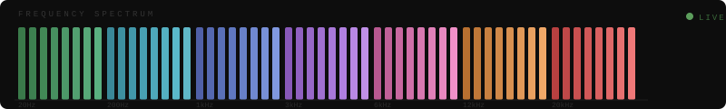

<div align="center">
🚀 [Live Demo](https://musicplayer9403.netlify.app/)

# 🎛️ MUSIC PLAYER 




### A Browser-Based Music Player & Audio Workstation

[](https://developer.mozilla.org/en-US/docs/Web/HTML)
[](https://developer.mozilla.org/en-US/docs/Web/CSS)
[](https://developer.mozilla.org/en-US/docs/Web/JavaScript)
[](https://developer.mozilla.org/en-US/docs/Web/API/Web_Audio_API)
[](https://github.com)
[](https://opensource.org/licenses/MIT)

> **A feature-rich, zero-dependency music player** built entirely with vanilla HTML, CSS, and the Web Audio API. Load your tracks and experience real-time audio visualization, studio-grade EQ controls, live effects chain, and a Trap Nation–style circular frequency visualizer — all running natively in your browser.

</div>

---

## ✨ Features

<table>
<tr>
<td width="50%">

### 🎵 Audio Engine
- **Web Audio API** powered playback engine
- **3-Band Equalizer** — Bass / Treble / Boost knobs with rotary SVG controls (±12 dB)
- **Volume & Pitch** sliders with real-time dB gain readout
- **Sample Rate** display (e.g. `44100 Hz`)
- **Playback Rate** — half-speed mode toggle

</td>
<td width="50%">

### 🎛️ Effects Chain
- **Reverb** — Convolver node with procedurally generated impulse response
- **Delay** — 350ms echo with 40% feedback loop
- **Flanger** — LFO-modulated delay (0.5Hz, 3ms depth)
- **Distortion** — Waveshaper with 4× oversampling
- Effects can be stacked in any combination

</td>
</tr>
<tr>
<td>

### 📊 Real-Time Visualizer
- **Trap Nation–style** circular spectrum visualizer
- **64 frequency bars** with logarithmic scaling
- Beat-reactive **ripple rings** & sparkle particles
- **Speaker cone model** drawn on canvas (surround rings, radial spokes, dust cap)
- Multi-color modes: Single / Dual / Full spectrum rainbow

</td>
<td>

### 📋 Playlist & Transport
- **Multi-file playlist** — drag & drop or click to add tracks
- **Auto-advance** to next track
- **Cue/Loop points** — set cue, jump to cue, toggle loop
- **Seek bar** — click to scrub, real-time elapsed/duration display
- **±10s seek** buttons, Stop button

</td>
</tr>
<tr>
<td>

### 📡 VU Meters
- Live **Bass / Mid / High** frequency meters
- Normalized 0–100 readout per band
- Smooth 50ms transitions

</td>
<td>

### 🖥️ UI / UX
- Dark monochrome terminal aesthetic (`#111` base)
- **Live clock** in header (HH:MM:SS)
- **Status indicator** (STANDBY / PLAYING / PAUSED) with blinking dot
- Responsive — panels hide on mobile `< 860px`
- Zero external dependencies — single HTML file

</td>
</tr>
</table>
---
---

## 🎧 How to Use

| Action | How |
|---|---|
| **Load a track** | Click the `↑ DROP TRACK / CLICK TO LOAD` zone, or drag & drop an audio file |
| **Add to playlist** | Drag files onto the right panel, or click `+ ADD` |
| **Play / Pause** | Click the `▶ PLAY` button or press the transport |
| **Seek** | Click anywhere on the progress bar |
| **Adjust EQ** | Drag the Bass / Treble / Boost knobs up/down |
| **Toggle effects** | Click REVERB / DELAY / FLANGER / DISTORT buttons |
| **Set loop point** | Click `SET CUE` then `JUMP CUE` to return, or `LOOP OFF` to loop |
| **Half speed** | Click `HALF SPD` to toggle 0.5× playback rate |

**Supported formats:** `MP3` · `WAV` · `OGG` · `FLAC` · `AAC` · `M4A`

---

## 🛠️ Technical Architecture

```
Web Audio API Signal Chain
──────────────────────────────────────────────────────────

  [MediaElementSource]
         │
         ▼
  [BiquadFilter: Bass]    ← lowshelf  @ 200Hz,  ±12dB
         │
         ▼
  [BiquadFilter: Treble]  ← highshelf @ 4000Hz, ±12dB
         │
         ▼
  [BiquadFilter: Boost]   ← peaking   @ 1000Hz, Q=0.8, ±12dB
         │
         ▼
  ┌── FX Chain (optional, in order) ──┐
  │  [WaveShaper: Distortion]          │  4× oversample
  │  [ConvolverNode: Reverb]           │  2s impulse response
  │  [DelayNode: Echo]                 │  350ms, fb=0.4
  │  [DelayNode + LFO: Flanger]        │  0.5Hz, depth=3ms
  └────────────────────────────────────┘
         │
         ▼
  [GainNode: Master Volume]
         │
         ▼
  [AnalyserNode: FFT=2048, smoothing=0.8]
         │
         ▼
  [AudioDestination]  +  [Canvas Visualizer]
```

---

## 🎨 Visualizer Color Modes

The circular visualizer supports three color modes, toggled via the `colorMode` variable:

| Mode | Description |
|---|---|
| `single` | All bars rendered in one hue (default: cyan) |
| `dual` | Two-color split across the spectrum |
| `multi` | Full rainbow gradient across all 64 bars |

Beat detection drives **ripple ring** spawning and **sparkle particle** emission from the tips of high-amplitude bars.

---

## 🤝 Contributing

Contributions, issues, and feature requests are welcome!

1. Fork the repository
2. Create your branch: `git checkout -b feature/your-feature`
3. Commit changes: `git commit -m 'Add your feature'`
4. Push: `git push origin feature/your-feature`
5. Open a Pull Request

---

## 👨‍💻 Developer

<div align="center">

**Guruprasath K**

[](https://guru-9403.github.io/Guru-Portfolio/)

</div>

---

## 📄 License

This project is licensed under the **MIT License** — see the [LICENSE](LICENSE) file for details.

---

<div align="center">


*Built with ♥ using pure HTML · CSS · JavaScript · Web Audio API*

</div>

